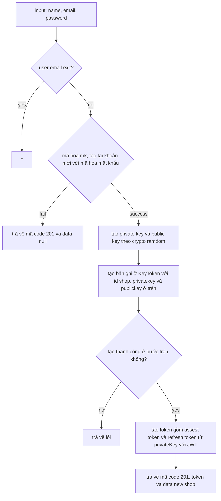

### flow sign up: 

```mermaid
graph 
  A[input: name, email, password] --> B{user email exit?}
  B -->|yes| D[*]
  B --> |no| E{mã hóa mk, tạo tài khoản mới với mã hóa mật khẩu}
  E --> |fail| O[trả về mã code 201 và data null]
  E --> |success| F[tạo private key và public key theo crypto ramdom]
  F --> J[ tạo bản ghi ở KeyToken với id shop, privatekey và publickey ở trên]
  J --> H{tạo thành công ở bước trên không?}
  H --> |no| I[trả về lỗi]
  H --> |yes| L[tạo token gồm assest token và refresh token từ privateKey với JWT]
  L --> M[trả về mã code 201, token và data new shop]
```