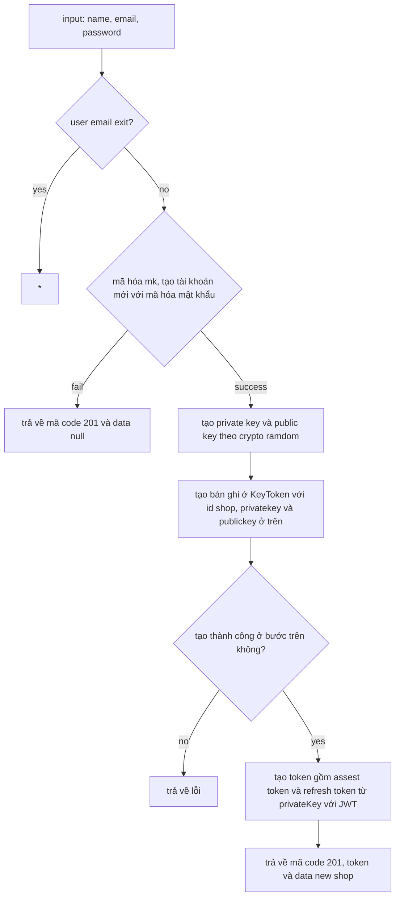
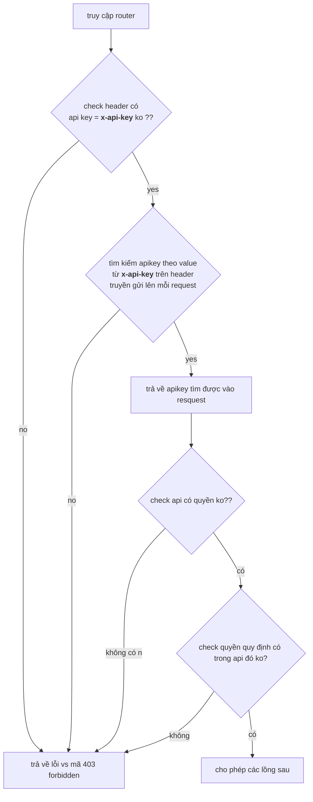

### flow sign up: 

```mermaid
graph 
  A[input: name, email, password] --> B{user email exit?}
  B -->|yes| D[*]
  B --> |no| E{mã hóa mk, tạo tài khoản mới với mã hóa mật khẩu}
  E --> |fail| O[trả về mã code 201 và data null]
  E --> |success| F[tạo private key và public key theo crypto ramdom]
  F --> J[ tạo bản ghi ở KeyToken với id shop, privatekey và publickey ở trên]
  J --> H{tạo thành công ở bước trên không?}
  H --> |no| I[trả về lỗi]
  H --> |yes| L[tạo token gồm assest token và refresh token từ privateKey với JWT]
  L --> M[trả về mã code 201, token và data new shop]
```

### flow check apikey: 

```mermaid
graph 
  A[truy cập router] --> B{check header có \n api key = <b>x-api-key</b> ko ??}
  B --> |no| C[trả về lỗi vs mã 403 forbidden]
  B --> |yes| D{tìm kiếm apikey theo value \ntừ <b>x-api-key</b> trên header\n truyền gửi lên mỗi request}
  D --> |no| C
  D --> |yes| E[trả về apikey tìm được vào resquest]
  E --> F{check api có quyền ko??}
  F --> |không có n| C
  F --> |có| K{check quyền quy định có trong api đó ko? }
  K --> |không| C
  K --> |có| L[cho phép các lồng sau]
```